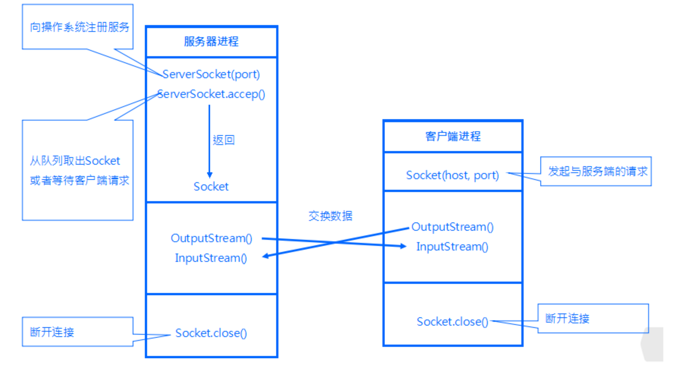
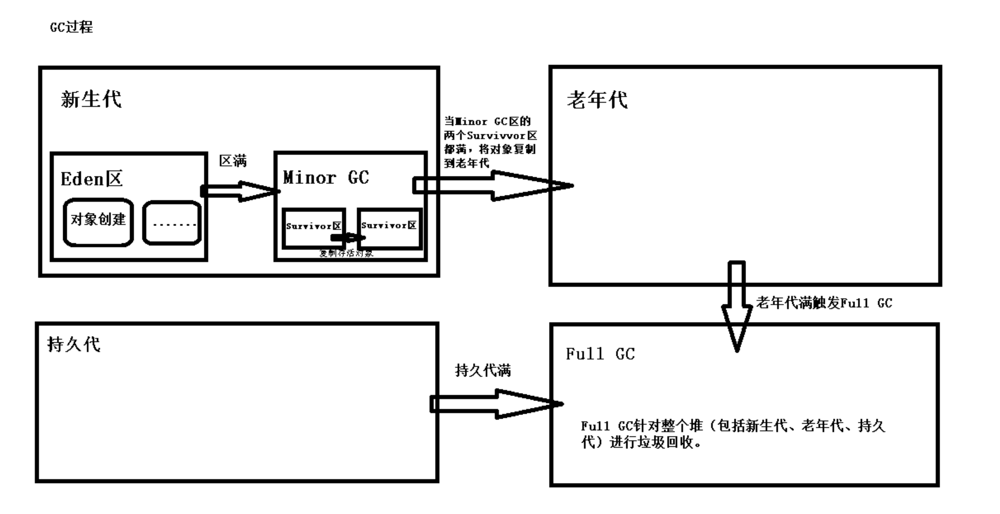
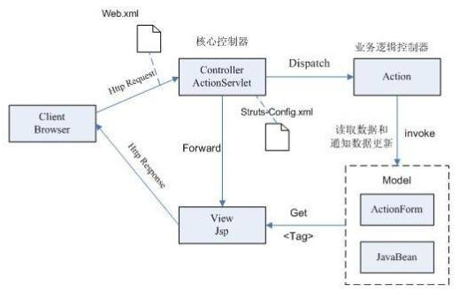
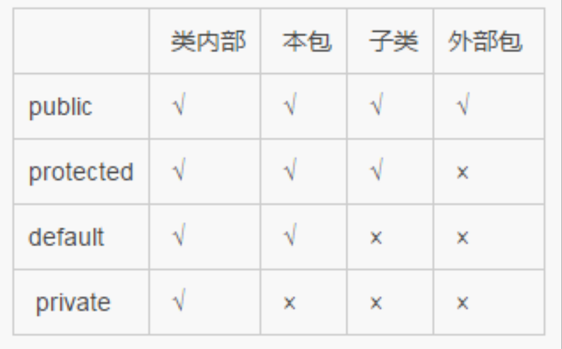
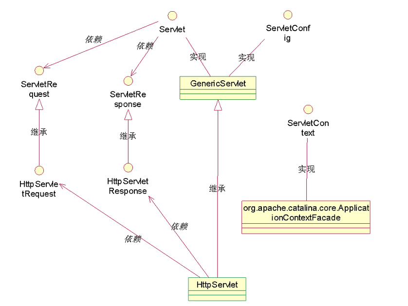
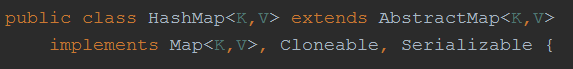
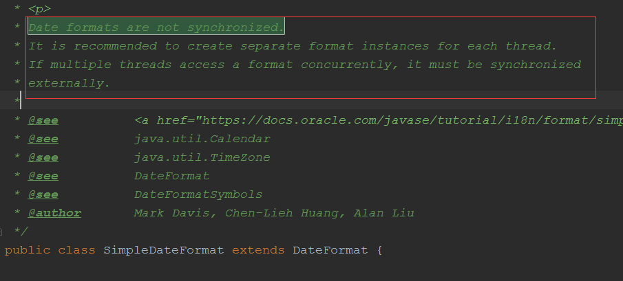

# java知识点,错误集锦

1. ### jvm问题

```tex
JVM运行时，数据区包含：虚拟机栈，堆，方法区，本地方法栈，程序计数器，
其中，堆和方法区是线程共享的，虚拟机栈和程序计数器是线程私有的。
```

2. ### statement,preparedstatement,callablestatement

```java
1.Statement、PreparedStatement和CallableStatement都是接口(interface)。 
2.Statement继承自Wrapper、
    PreparedStatement继承自Statement、
    CallableStatement继承自PreparedStatement。 
3. 
    Statement接口提供了执行语句和获取结果的基本方法； 
    PreparedStatement接口添加了处理 IN 参数的方法； 
    CallableStatement接口添加了处理 OUT 参数的方法。 
4. 
    a.Statement: 
        普通的不带参的查询SQL；支持批量更新,批量删除; 
    b.PreparedStatement: 
        可变参数的SQL,编译一次,执行多次,效率高; 
        安全性好，有效防止Sql注入等问题; 
        支持批量更新,批量删除; 
    c.CallableStatement: 
        继承自PreparedStatement,支持带参数的SQL操作; 
        支持调用存储过程,提供了对输出和输入/输出参数(INOUT)的支持; 
5.
    Statement每次执行sql语句，数据库都要执行sql语句的编译 ， 
    最好用于仅执行一次查询并返回结果的情形，效率高于PreparedStatement。 
6.
    PreparedStatement是预编译的，使用PreparedStatement有几个好处 
    a. 在执行可变参数的一条SQL时，PreparedStatement比Statement的效率高，
       因为DBMS预编译一条SQL当然会比多次编译一条SQL的效率要高。 
    b. 安全性好，有效防止Sql注入等问题。 
    c. 对于多次重复执行的语句，使用PreparedStament效率会更高一点，
       并且在这种情况下也比较适合使用batch； 
    d. 代码的可读性和可维护性。
```

3. ### spring 事物的传播性

```java
PROPAGATION_REQUIRED--支持当前事务，如果当前没有事务，就新建一个事务。
PROPAGATION_SUPPORTS--支持当前事务，如果当前没有事务，就以非事务方式执行。 
PROPAGATION_MANDATORY--支持当前事务，如果当前没有事务，就抛出异常。 
PROPAGATION_REQUIRES_NEW--新建事务，如果当前存在事务，把当前事务挂起。 
PROPAGATION_NOT_SUPPORTED--以非事务方式执行，如果当前存在事务，把当前事务挂起。 
PROPAGATION_NEVER--以非事务方式执行，如果当前存在事务，则抛出异常。
```

4. ### servlet和CGI的比较

```java
和CGI程序一样，Servlet可以响应用户的指令(提交一个FORM等等)，也可以象CGI程序一样，
    收集用户表单的信息并给予动态反馈(简单的注册信息录入和检查错误)。
然而，Servlet的机制并不仅仅是这样简单的与用户表单进行交互。传统技术中，
    动态的网页建立和显示都是通过CGI来实现的，但是，有了Servlet,
    您可以大胆的放弃所有CGI(perl?php?甚至asp!)，利用Servlet代替CGI,进行程序编写。
对比一：当用户浏览器发出一个Http/CGI的请求，或者说 调用一个CGI程序的时候，
    服务器端就要新启用一个进程 (而且是每次都要调用)，
    调用CGI程序越多(特别是访问量高的时候)，就要消耗系统越多的处理时间，
    只剩下越来越少的系统资源，对于用户来说，只能是漫长的等待服务器端的返回页面了，
    这对于电子商务激烈发展的今天来说，不能不说是一种技术上的遗憾。
    而Servlet充分发挥了服务器端的资源并高效的利用。
    每次调用Servlet时并不是新启用一个进程 ，
    而是在一个Web服务器的进程敏感词享和分离线程，
    而线程最大的好处在于可以共享一个数据源，使系统资源被有效利用。
对比二：传统的CGI程序，不具备平台无关性特征，系统环境发生变化，
    CGI程序就要瘫痪，而Servlet具备Java的平台无关性，
    在系统开发过程中保持了系统的可扩展性、高效性。
对比三：传统技术中，一般大都为二层的系统架构，即Web服务器+数据库服务器，
    导致网站访问量大的时候，无法克服CGI程序与数据库建立连接时速度慢的瓶颈，
    从而死机、数据库死锁现象频繁发生。而我们的Servlet有连接池的概念，
    它可以利用多线程的优点，在系统缓存中事先建立好若干与数据库的连接，
    到时候若想和数据库打交道可以随时跟系统"要"一个连接即可，反应速度可想而知。
```

5. ### servlet的生命周期

   ```tex
   Servlet的生命周期分为5个阶段：加载、创建、初始化、处理客户请求、卸载。
   (1)加载：容器通过类加载器使用servlet类对应的文件加载servlet
   (2)创建：通过调用servlet构造函数创建一个servlet对象
   (3)初始化：调用init方法初始化
   (4)处理客户请求：每当有一个客户请求，容器会创建一个线程来处理客户请求
   (5)卸载：调用destroy方法让servlet自己释放其占用的资源
   ```

6. ### servlet线程安全问题(servlet在多线程下其本身并不是线程安全的)

```tex
servlet 对象在 tomcat 服务器是单实例多线程的。 因为 servlet 是多线程的，
所以当多个 servlet 的线程同时访问了 servlet 的共享数据，如成员变量，可能会引发线程安全问题。
    
解决办法：
         1 ）把使用到共享数据的代码块进行同步（使用 synchronized 关键字进行同步）
         2 ）建议在 servlet 类中尽量不要使用成员变量。如果确实要使用成员，
         	必须同步。而且尽量缩小同步代码块的范围。
         	（哪里使用到了成员变量，就同步哪里！！），
         	以避免因为同步而导致并发效率降低。
```

7. ### struts1和Struts2的区别

```java
从action类上分析:
1.Struts1要求Action类继承一个抽象基类。
    Struts1的一个普遍问题是使用抽象类编程而不是接口。 
    
2. Struts 2 Action类可以实现一个Action接口，也可实现其他接口，
    使可选和定制的服务成为可能。Struts2提供一个ActionSupport基类去实现常用的接口。
    Action接口不是必须的，任何有execute标识的POJO对象都可以用作Struts2的Action对象。
    
从Servlet 依赖分析: 
3. Struts1 Action 依赖于Servlet API ,
    因为当一个Action被调用时HttpServletRequest 和 HttpServletResponse 
    被传递给execute方法。 
    
4. Struts 2 Action不依赖于容器，允许Action脱离容器单独被测试。
    如果需要，Struts2 Action仍然可以访问初始的request和response。但是，
    其他的元素减少或者消除了直接访问HttpServetRequest 和 HttpServletResponse
    的必要性。
    
从action线程模式分析: 
5. Struts1 Action是单例模式并且必须是线程安全的，
    因为仅有Action的一个实例来处理所有的请求。
    单例策略限制了Struts1 Action能作的事，并且要在开发时特别小心。
    Action资源必须是线程安全的或同步的。
    
6. Struts2 Action对象为每一个请求产生一个实例，因此没有线程安全问题。
    （实际上，servlet容器给每个请求产生许多可丢弃的对象，
    并且不会导致性能和垃圾回收问题）
```

8. ### 关于Java类的问题

```tex
java是单继承,多实现,也就是Java类只有一个直接父类,但是可以有多个实现,可以有多个子类
```

9. ### HashMap的问题

```java
JDK8以后，HashMap的数据结构是 数组+链表+红黑树

HashMap内部包含了一个默认大小为 16 Entry 类型的数组 table,其中每个Entry 是一个链表，
当链表长度大于等于 8 时会将链表转换为红黑树。

jdk1.7 中使用个 Entry 数组来存储数据，用key的 hashcode 取模来决定key会被放到数组里的位置，
如果 hashcode 相同，或者 hashcode 取模后的结果相同（ hash collision ），那么这些 key 会被定位到
Entry 数组的同一个格子里，这些 key 会形成一个链表。在 hashcode 特别差的情况下，比方说所有key的
hashcode 都相同，这个链表可能会很长，那么 put/get 操作都可能需要遍历这个链表，也就是说时间复杂度在最
差情况下会退化到 O(n) 
 
jdk1.8 中使用一个 Node 数组来存储数据，但这个 Node 可能是链表结构，也可能是红黑树结构，如果插入的
key 的 hashcode 相同，那么这些key也会被定位到 Node 数组的同个格子里。
如果同一个格子里的key不超过8个，使用链表结构存储。如果超过了8个，那么会调用 treeifyBin 函数，
将链表转换为红黑树。那么即使 hashcode 完全相同，由于红黑树的特点，查找某个特定元素，也只需要O(log n)
的开销也就是说put/get的操作的时间复杂度最差只有 O(log n)，
但是真正想要利用 JDK1.8 的好处，有一个限制：key的对象，必须正确的实现了 Compare 接口。
```

10. ### java哪个包不用手动导入

```java
  java.lang包是java语言包，是自动导入的。 

  java.util包是java的工具包，需要手动导入。 

  java.sql包，JDBC接口类，需要手动导入。 

  java.io;各种输入输入流，需要手动导入。
```

11. ### socket问题(如果希望监听TCP端口9000，服务器端应该怎样创建socket?)



```tex
ServerSocket(int port) 是服务端绑定port端口，调accept()监听等待客户端连接，它返回一个连接队列中的一个socket。
    
Socket(InetAddress address , int port)是创建客户端连接主机的socket流，其中InetAddress是用来记录主机的类，port指定端口。
```

12. ### &&与||  &   |  区别

```tex
&&与||这两个是短路方式求值的,也就是只要左边的表达式符合要求右边的就不再执行
&与| 这两个是位运算符,两边都得计算
```

13. ### ArrayList, LinkedList, Vector，HashMap，Hashtable区别

```tex
Arraylist：
优点：ArrayList 是实现了基于动态数组的数据结构,因为地址连续，一旦数据存储好了，查询操作效率会比较高（在内存里是连着放的）。
缺点：因为地址连续， ArrayList 要移动数据,所以插入和删除操作效率比较低。
  
LinkedList：
优点：LinkedList 基于链表的数据结构,地址是任意的，所以在开辟内存空间的时候不需要等一个连续的地址，对于新增和删除操作 add 和 remove，LinedList 比较占优势。LinkedList 适用于要头尾操作或插入指定位置的场景
缺点：因为 LinkedList 要移动指针,所以查询操作性能比较低

适用场景分析：
当需要对数据进行对此访问的情况下选用 ArrayList，当需要对数据进行多次增加删除修改时采用 LinkedList。

ArrayList 和 Vector 都是用数组实现的，主要有这么四个区别：
(1)	Vector 是多线程安全的，线程安全就是说多线程访问同一代码，不会产生不确定的结果。而 ArrayList 不是，这个可以从源码中看出，Vector 类中的方法很多有 synchronized 进行修饰，这样就导致了 Vector 在效率上无法与 ArrayList 相比；
(2)	两个都是采用的线性连续空间存储元素，但是当空间不足的时候，两个类的增加方式不同。
(3)	Vector 可以设置增长因子，而 ArrayList 不可以。
(4)	Vector 是一种老的动态数组，是线程同步的，效率很低，一般不赞成使用。


适用场景分析：
1)	Vector 是线程同步的，所以它也是线程安全的，而 ArrayList 是线程异步的，是不安全的。如果不考虑到线程的安全因素，一般用 ArrayList 效率比较高。
2)	如果集合中的元素的数目大于目前集合数组的长度时，在集合中使用数据量比较大的数据，用Vector 有一定的优势。

HashMap 和 Hashtable 的区别
1.	hashMap 去掉了 HashTable 的 contains 方法，但是加上了 containsValue()和 containsKey()
方法。
2.	hashTable 同步的，而 HashMap 是非同步的，效率上比 hashTable 要高。
3.	hashMap 允许空键值，而 hashTable 不允许，HashMap可以用null值和空字符串作为Key,不过只能有一个。 

TreeMap：非线程安全基于红黑树实现。
TreeMap 没有调优选项，因为该树总处于平衡状态。
Treemap：适用于按自然顺序或自定义顺序遍历键(key)。

HashSet 和 HashMap 区别

1)	set 是线性结构，set 中的值不能重复，hashset 是 set 的 hash 实现，hashset 中值不能重复是用 hashmap 的 key 来实现的。
2)	map 是键值对映射，可以空键空值。HashMap 是 Map 接口的 hash 实现，key 的唯一性是通过 key 值 hash 值的唯一来确定，value 值是则是链表结构。
3)	他们的共同点都是 hash 算法实现的唯一性，他们都不能持有基本类型，只能持有对象

HashMap 和 ConcurrentHashMap 的区别
ConcurrentHashMap 是线程安全的 HashMap 的实现。
(1)	ConcurrentHashMap 对整个桶数组进行了分割分段(Segment)，然后在每一个分段上都用
lock 锁进行保护，相对于 HashTable 的 syn 关键字锁的粒度更精细了一些，并发性能更好，而 HashMap 没有锁机制，不是线程安全的。
(2)	HashMap 的键值对允许有 null，但是 ConCurrentHashMap 都不允许。


```

14. ### 关于线程安全的集合问题

```java
1.Collection 是对象集合， Collection 有两个子接口 List 和 Set;

2.List 可以通过下标 (1,2..) 来取得值，值可以重复,而 Set只能通过游标来取值，并且值是不能重复的，（list是无序且可以重复的    set是有序且不可重复的） 

3.  ArrayList ， Vector ， LinkedList 是  List 的实现类 
     ArrayList 是线程不安全的， 
     Vector是线程安全的，
     这两个类底层都是由数组实现的 

     LinkedList 是线程不安全的，底层是由链表实现的 

4.Map 是键值对集合   HashTable 和 HashMap 是 Map 的实现类 

5.HashTable 是线程安全的，不能存储 null 值 

6.HashMap 不是线程安全的，可以存储 null 值 
```

15. ### 代码块的执行顺序

```tex
静态代码块>>构造代码块>>构造函数
```

16. ### 自动转换由低到高

```tex
byte < short < char < int < long < float < double
```

17. ### 触发 full GC的可能性



```tex
  1，新生代：
  （1）所有对象创建在新生代的Eden区，当Eden区满后触发新生代的Minor GC，将Eden区和非空闲				Survivor区存活的对象复制到另外一个空闲的Survivor区中。
  （2）保证一个Survivor区是空的，新生代Minor GC就是在两个Survivor区之间相互复制存活对象，	直到		Survivor区满为止。 
 
  2，老年代：当Survivor区也满了之后就通过Minor GC将对象复制到老年代。老年代也满了的话，就将触发Full GC，针对整个堆（包括新生代、老年代、持久代）进行垃圾回收。 
 
  3，持久代：持久代如果满了，将触发Full GC。 
```

18. ### 避免程序读到不正确的值,易混淆的知识点

```tex
synchronized是修饰代码块,方法,或者对象

volatile或者static volatile修饰的是变量
```

19. ### java 关键字和保留字

```tex
    goto和const是保留字也是关键字。

  1，Java 关键字列表 (依字母排序 共50组)： 

  abstract, assert, boolean, break, byte, case, catch, char, class,
  const（保留关键字）, continue, default, do, double, else,
  enum, extends, final, finally, float, for,
  goto（保留关键字）, if, implements, import, instanceof, int,
  interface, long, native, new, package, private, protected, public,
  return, short, static, strictfp, super, switch, synchronized, this,
  throw, throws, transient, try, void, volatile, while 

  2，保留字列表 (依字母排序
  共14组)，Java保留字是指现有Java版本尚未使用，但以后版本可能会作为关键字使用： 

  byValue, cast, false, future, generic, inner,
  operator, outer, rest, true, var, goto（保留关键字）,  const（保留关键字）,  null
```

20. ### 构造函数的问题

```tex
如果父类只有有参构造函数,则子类构造函数必须调用
```

21. ### try  catch  finally 的问题

```tex
根据官方的JVM规范：

  如果try语句里有return，返回的是try语句块中变量值。
  
详细执行过程如下：


  
1. 如果有返回值，就把返回值保存到局部变量中；  
2. 执行jsr指令跳到finally语句里执行；  
3. 执行完finally语句后，返回之前保存在局部变量表里的值。


  如果try，finally语句里均有return，忽略try的return，而使用finally的return.
```

22. ### 地址的问题

```tex
  &a表示 取a的地址 
 
  p=&a 所以p保存的a的地址 
 
  &*p  表示取指针*p自己的地址（并非它指向的地址） ,它的每次运行结果都将不一样 
```

23. ### 抽象类方法的访问权限

```tex

  关于抽象类 
 
  JDK 1.8以前，抽象类的方法默认访问权限为protected 
 
  JDK 1.8时，抽象类的方法默认访问权限变为default 
 
  
 
 
  关于接口 
 
  JDK 1.8以前，接口中的方法必须是public的 
 
  JDK 1.8时，接口中的方法可以是public的，也可以是default的 
 
  JDK 1.9时，接口中的方法可以是private的 
```

24. ### 对于ArrayLists和LinkedList的区别

```tex
A. ArrayList是实现了基于动态数组的数据结构，LinkedList基于链表的数据结构。
     //正确，这里的所谓动态数组并不是那个“ 有多少元素就申请多少空间 
”的意思，通过查看源码，可以发现，这个动态数组是这样实现的，如果没指定数组大小，则申请默认大小为10的数组，当元素个数增加，数组无法存储时，系统会另个申请一个长度为当前长度1.5倍的数组，然后，把之前的数据拷贝到新建的数组。

B. 对于随机访问get和set，ArrayList觉得优于LinkedList，因为LinkedList要移动指针。//正确，ArrayList是数组，所以，直接定位到相应位置取元素，LinkedLIst是链表，所以需要从前往后遍历。


C. 对于新增和删除操作add和remove，LinedList比较占优势，因为ArrayList要移动数据。//正确，ArrayList的新增和删除就是数组的新增和删除，LinkedList与链表一致。


D. ArrayList的空间浪费主要体现在在list列表的结尾预留一定的容量空间，而LinkedList的空间花费则体现在它的每一个元素都需要消耗相当的空间。//正确，因为ArrayList空间的增长率为1.5倍，所以，最后很可能留下一部分空间是没有用到的，因此，会造成浪费的情况。对于LInkedList的话，由于每个节点都需要额外的指针，
```

25. ### 比较数值的问题

```java
  针对以下代码，哪些选项执行后是true的：（） 

class CompareReference{
   public static void main(String [] args){
   float f=42.0f;
   float f1[]=new float[2];
   float f2[]=new float[2];
   float[] f3=f1;
   long x=42;
   f1[0]=42.0f;
  }
}

BC正确，选项B解释，java核心卷I中43页有如下表述：两个数值进行二元操作时，
会有如下的转换操作：
如果两个操作数其中有一个是double类型，另一个操作就会转换为double类型。
否则，如果其中一个操作数是float类型，另一个将会转换为float类型。
否则，如果其中一个操作数是long类型，另一个会转换为long类型。
否则，两个操作数都转换为int类型。
故，x==f1[0]中，x将会转换为float类
```

26. ### 哪些是object方法

```java
A synchronized()
B wait()
C notify()
D notifyAll()
E sleep()

A    synchronized     Java语言的关键字，当它用来修饰一个方法或者一个代码块的时候，
                        能够保证在同一时刻最多只有一个线程执行该段代码。
B  C   D 都是Object类中的方法    
                    notify():  是唤醒一个正在等待该对象的线程。  
                    notifyAll(): 唤醒所有正在等待该对象的线程。
E         sleep 是Thread类中的方法

wait 和 sleep的区别：
        wait指线程处于进入等待状态，形象地说明为“等待使用CPU”，
        此时线程不占用任何资源，不增加时间限制。
        sleep指线程被调用时，占着CPU不工作，形象地说明为“占着CPU睡觉”，
        此时，系统的CPU部分资源被占用，其他线程无法进入，会增加时间限制。
```

27. ### 关于软强虚弱引用的问题

28. ### 实现线程问题

```tex
实现多线程的三种方式，一种是继承Thread类使用此方式就不能继承其他的类了。
还有两种是实现Runnable接口或者实现Callable接口
```

29. ### resultset的知识点

```tex
ResultSet跟普通的数组不同，索引从1开始而不是从0开始
```

30. ### 关于多线程的问题

```java
下列关于JAVA多线程的叙述正确的是（）

A.调用start()方法和run()都可以启动一个线程

B.CyclicBarrier和CountDownLatch都可以让一组线程等待其他线程

C.Callable类的call()方法可以返回值和抛出异常

D.新建的线程调用start()方法就能立即进行运行状态

A，start是开启线程，run是线程的执行体，run是线程执行的入口。
B，CyclicBarrier和CountDownLatch都可以让一组线程等待其他线程。
    前者是让一组线程相互等待到某一个状态再执行。
    后者是一个线程等待其他线程结束再执行。
C，Callable中的call比Runnable中的run厉害就厉害在有返回值和可以抛出异常。
    同时这个返回值和线程池一起用的时候可以返回一个异步对象Future。
D，start是把线程从new变成了runnable
```

31. ### 关于数组的问题

```tex
1.数组的正确定义
        int[] i = new int[]{1,2,3};
        int[] j = new int[]{1,2,3};
        int[] array = new int[100];
        double[] array_1 = new double[100];
2.数组长度是不能动态调整的;
3.数组的equals方法是object的equals，比较的是内存地址
```

32. ###  关于浏览器的一些问题

```tex
length 返回浏览器历史列表中的URL数量。
back() 加载 history列表中的前一个URL。
forward() 加载  history  列表中的下一个URL。
go()  加载history列表中的某个具体页面。
```

33. ### 关于swing和awt的区别

```java
AWT ：是通过调用操作系统的native方法实现的，
        所以在Windows系统上的AWT窗口就是Windows的风格，
        而在Unix系统上的则是XWindow风格。
Swing : 由纯Java写成，可移植性好，外观在不同平台上相同。
        所以Swing部件称为轻量级组件（ Swing是由纯JAVA CODE所写的，
        因此SWING解决了JAVA因窗口类而无法跨平台的问题，
        使窗口功能也具有跨平台与延展性的特性，
        而且SWING不需占有太多系统资源，因此称为轻量级组件！！！）
```

34. ### 加载驱动程序的方法有哪些

```tex
  加载驱动方法

  1.Class.forName("com.microsoft.sqlserver.jdbc.SQLServerDriver");

  2. DriverManager.registerDriver(new com.mysql.jdbc.Driver());

  3. System.setProperty("jdbc.drivers", "com.mysql.jdbc.Driver");
```

35. ### 关于wait() 和sleep()

```tex
Java中的多线程是一种抢占式的机制，而不是分时机制。抢占式的机制是有多个线程处于可运行状态，但是只有一个线程在运行。 

  共同点： 
 1. 他们都是在多线程的环境下，都可以在程序的调用处阻塞指定的毫秒数，并返回。 

  2. wait()和sleep()都可以通过interrupt()方法 打断线程的暂停状态
  ，从而使线程立刻抛出InterruptedException。 

  如果线程A希望立即结束线程B，则可以对线程B对应的Thread实例调用interrupt方法。如果此刻线程B正在wait/sleep/join，则线程B会立刻抛出InterruptedException，在catch(){} 中直接return即可安全地结束线程。 

  需要注意的是，InterruptedException是线程自己从内部抛出的，并不是interrupt()方法抛出的。对某一线程调用
  interrupt()时，如果该线程正在执行普通的代码，那么该线程根本就不会抛出InterruptedException。但是，一旦该线程进入到
  wait()/sleep()/join()后，就会立刻抛出InterruptedException 。 

  不同点 ： 
  
  1.每个对象都有一个锁来控制同步访问。Synchronized关键字可以和对象的锁交互，来实现线程的同步。 

  	sleep方法没有释放锁，而wait方法释放了锁，使得其他线程可以使用同步控制块或者方法。 

  2.wait，notify和notifyAll只能在同步控制方法或者同步控制块里面使用，而sleep可以在任何地方使用 

  3.sleep必须捕获异常，而wait，notify和notifyAll不需要捕获异常  
  
  4.sleep是线程类（Thread）的方法，导致此线程暂停执行指定时间，给执行机会给其他线程，但是监控状态依然保持，到时后会自动恢复。调用sleep不会释放对象锁。  

  5.wait是Object类的方法，对此对象调用wait方法导致本线程放弃对象锁，进入等待此对象的等待锁定池，只有针对此对象发出notify方法（或notifyAll）后本线程才进入对象锁定池准备获得对象锁进入运行状态。  
```

36. ### 关于struts问题



37. ### 有关jsp静态和动态include的区别

```javascript
    动态 INCLUDE
    用 jsp:include 动作实现
     <jsp:include page="included.jsp" flush="true" />
    它总是会检查所含文件中的变化,
    适合用于包含动态页面,
    并且可以带参数。各个文件分别先编译，然后组合成一个文件。

    静态 INCLUDE用 include伪码实现,
    定不会检查所含文件的变化,
    适用于包含静态页面
    <%@ include file="included.htm" %>
    先将文件的代码被原封不动地加入到了主页面从而合成一个文件，然后再进行翻译，此时不允许有相同的变量。
    
    以下是对include 两种用法的区别，
    主要有两个方面的不同;  
    一:
    执行时间上 :

    <%@ include file="relativeURI"%> 
    是在翻译阶段执行

    <jsp:include page="relativeURI"
      flush="true" /> 
    在请求处理阶段执行.
      
    二 :引入内容的不同 :
  
    <%@ include file="relativeURI"%>
    
    引入静态文本(html,jsp),在JSP页面被转化成servlet之前和它融和到一起.
    <jsp:include page="relativeURI" flush="true" />
    引入执行页面或servlet所生成的应答文本.
```

38. ### 关于JVM参数问题

```java
-Xmx10240m -Xms10240m -Xmn5120m -XXSurvivorRatio=3
  
-Xmx：最大堆大小
-Xms：初始堆大小
-Xmn:年轻代大小
-XXSurvivorRatio：年轻代中Eden区与Survivor区的大小比值
年轻代5120m， Eden：Survivor=3，
   Survivor区大小=1024m（Survivor区有两个，即将年轻代分为5份，
   每个Survivor区占一份），总大小为2048m。
-Xms初始堆大小即最小内存值为10240m
```

39. ### 注解 @SuppressWarnings(“deprecation”)的功能是什么？

```java
1.Java三大注解分别是@Override @Deprecated @Suppresswarnings
2.@Override 注解表名子类中覆盖了超类中的某个方法，如果写错了覆盖形式，
    编译器会报错
3.@Deprecated 表明不希望别人在以后使用这个类，方法，变量等等
4.@Suppresswarnings 达到抑制编译器产生警告的目的，但是不建议使用，
    因为后期编码人员看不懂编译器提示的警告，不能更好的选择更好的类去完成任务
```

40. ### 关于int和integer的问题

```tex
总体主要分为两个方面
1.比较的是值
一、基本数据类型与引用数据类型进行比较时，引用数据类型会进行拆箱，然后与基本数据类型进行值的比较
举例：
int  i = 12;
Integer j = new Integer(12);
i == j  返回的是true
二、引用数据类型与基本数据类型进行比较（equals方法），基本数据类型会进行自动装箱，与引用数据类型进行比较，Object中的equals方法比较的是地址，但是Integer类已经重写了equals方法，只要两个对象的值相同，则可视为同一对象，具体看API文档，所以这归根到底也是值的比较！
举例：
int  i = 12;
Integer j = new Integer(12);
j.equals(i)  返回的是true
2.比较的是地址
一、如果引用数据类型是这样 Integer i = 12;直接从常量池取对象，这是如果数值是在-128与127之间，则视为同一对象，否则视为不同对象
举例：
Integer i = 12; Integer j = 12;   i == j 返回的是true
Integer i = 128; Integer j = 128;   i == j 返回的是false
二、如果引用数据类型是直接new的话，不管值是否相同，这时两个对象都是不相同的，因为都会各自在堆内存中开辟一块空间
举例：
Integer i  =new Integer(12);
Integer j = new Integer(12);
i == j  这时返回的是false
三、从常量池取对象跟new出来的对象也是不同的
举例：
Integer i  = 12;
Integer j = new Integer(12)
i == j 这时返回的是false，因为第二个语句其实已经是new了两个对象了！！！
```

41. ### 关于接口的问题

```tex
A 可以调用父类无参的构造函数，子类的有参构造函数和是否调用父类的有参数的构造函数无必然联系。  
  
B 接口继承的时候只能继承接口不能继承类，因为如果类可以存在非抽象的成员，如果接口继承了该类，那么接口必定从类中也继承了这些非抽象成员，这就和接口的定义相互矛盾，所以接口继承时只能继承接口。  
  
C 接口可以多继承可以被多实现，因为接口中的方法都是抽象的，这些方法都被实现的类所实现，即使多个父接口中有同名的方法，在调用这些方法时调用的时子类的中被实现的方法，不存在歧义；同时，接口的中只有静态的常量，但是由于静态变量是在编译期决定调用关系的，即使存在一定的冲突也会在编译时提示出错；而引用静态变量一般直接使用类名或接口名，从而避免产生歧义，因此也不存在多继承的第一个缺点。
 对于一个接口继承多个父接口的情况也一样不存在这些缺点。所以接口可以多继承。 
 
D 子类即使没有显示构造函数，也会有个无参数的默认构造函数，仍然会调用父类的构造函数。
```

42. ### 关于static的问题

```tex
被sataic声明的为静态方法，可以直接通过类名调用而不需要通过对象调用。
```

43. ### 权限的问题



```tex
protected是类权限
default是包权限
```

44. ### servletconfig接口默认是在哪实现的



45. ### 关于调用父类构造方法的问题

```tex
1.在调用子类构造器之前，会先调用父类构造器，
2.当子类构造器中没有使用"super(参数或无参数)"指定调用父类构造器时，是默认调用父类的无参构造器，
3.如果父类中包含有参构造器，却没有无参构造器，则在子类构造器中一定要使用“super(参数)”指定调用父类的有参构造器，不然就会报错
```

46. ### this的问题

```tex
this()才必须是构造函数中的第一个可执行语句，用this调用语句并不需要。
```

47. ### 线程安全的问题

```tex
  1.synchrozied关键字称作同步，主要用来给方法、代码块加锁，被加锁的代码段，同一时间内多线程同时访问同一对象的加锁方法/代码块时，只能有一个线程执行能执行方法/代码块中的代码，其余线程必须等待当前线程执行完以后才执行该方法/代码块。 
 
  2.volatile关键字1.保证了不同线程对该变量操作的内存可见性.(当一个线程修改了变量,其他使用次变量的线程可以立即知道这一修改)。2.禁止了指令重排序. 
   
  3.Lock接口提供了与synchronized关键字类似的同步功能，但需要在使用时手动获取锁和释放锁。   
 transient关键字  简单地说，就是让某些被修饰的成员属性变量不被序列化。
```

48. ### 下列说法正确的是

```tex
A.ConcurrentHashMap使用synchronized关键字保证线程安全

B.HashMap实现了Collction接口

C.Array.asList方法返回java.util.ArrayList对象

D.SimpleDateFormat是线程不安全的

解析:
A. JDK1.8 的 ConcurrentHashMap 采用CAS+Synchronized保证线程安全。 JDK1.7
  及以前采用segment的分段锁机制实现线程安全，其中segment继承自ReentrantLock，因此采用Lock锁来保证线程安全。 

B. 

C. Arrays.asList()  返回  java.util.Arrays.ArrayList 对象，这里的ArrayList 是 Arrays 私有的内部类 

D. 
```





49. ### Java数据库连接JDBC使用到了哪种设计模式(桥接模式)

```tex
JDBC连接数据库的时候，在各个数据库之间进行切换，基本不需要动太多的代码，甚至丝毫不动，原因就是JDBC提供了统一接口，每个数据库提供各自的实现，用一个叫做数据库驱动的程序来桥接就行了
```

50. ### 关于引用传递和值传递的问题

```tex
引用数据类型是引用传递（call by reference），基本数据类型是值传递（call by value） 

值传递不可以改变原变量的内容和地址---》原因是java方法的形参传递都是传递原变量的副本，在方法中改变的是副本的值，而不适合原变量的 

引用传递不可以改变原变量的地址，但可以改变原变量的内容---》原因是当副本的引用改变时，原变量 的引用并没有发生变化，当副本改变内容时，由于副本引用指向的是原变量的地址空间，所以，原变量的内容发生变化。

结论：1.值传递不可以改变原变量的内容和地址；
	 2.引用传递不可以改变原变量的地址，但可以改变原变量的内容；
```

51. ### 关于死锁 的问题

```tex
死锁防止：
破除互斥等待：一般无法破除
破除hold and wait：一次性获取所有资源
破除循环等待：按顺序获取资源
破除无法剥夺的等待：加入超时
（死锁：同时满足这4个条件）
```

52. ### DHTML的问题

```java
  DHTML实现了网页从Web服务器下载后无需再经过服务的处理，而在浏览器中直接动态地更新网页的内容、排版样式和动画的功能。例如，当鼠标指针移到文章段落中时，段落能够变成蓝色，或者当鼠标指针移到一个超级链接上时，会自动生成一个下拉式子链接目录等。 

  包括： 

      ①动态内容(Dynamic Content)：动态地更新网页内容，可“动态”地插入、修改或删除网页的元件，如文字、图像、标记等。 

      ②动态排版样式(Dynamic Style  Sheets)：W3C的CSS样式表提供了设定HTML标记的字体大小、字形、样式、粗细、文字颜色、行高度、加底线或加中间横线、缩排、与边缘距离、靠左右或置中、背景图片或颜色等排版功能，而“动态排版样式”即可以“动态”地改变排版样式。 
```

53. ### 关于外部类和内部类

```tex
对于外部类来说，只有两种修饰，public和默认（default），
    因为外部类放在包中，只有两种可能，包可见和包不可见。
对于内部类来说，可以有所有的修饰，因为内部类放在外部类中，
    与成员变量的地位一致，所以有四种可能。
```

54. ### 方法的重载和重写

```tex
 override （重写）
1. 方法名、参数、返回值相同。
2. 子类方法不能缩小父类方法的访问权限。
3. 子类方法不能抛出比父类方法更多的异常(但子类方法可以不抛出异常)。
4. 存在于父类和子类之间。
5. 方法被定义为 final 不能被重写。

 overload （重载）
1. 参数类型、个数、顺序至少有一个不相同。
2. 不能重载只有返回值不同的方法名。
3. 存在于父类和子类、同类中。
```

| **区别点** | **重载**              | **重写（覆写）**            |
| ------- | ------------------- | --------------------- |
| 英文      | Overloading         | Overiding             |
| 定义      | 方法名称相同，参数的类型或  个数不同 | 方法名称、参数类型、返回值类型全部  相同 |
| 权限      | 对权限没要求              | 被重写的方法不能拥有更严格的权限      |
| 范围      | 发生在一个类中             | 发生在继承类中               |

54. ### 抽象类和接口有什么区别

```tex
	接口是公开的，里面不能有私有的方法或变量，是用于让别人使用的，而抽象类是可以  有私有方法或私有变量的；
	另外，实现接口的一定要实现接口里定义的所有方法，而实现抽象类可以有选择地重写   需要用到的方法，一般的应用里，最顶级的是接口，然后是抽象类实现接口，最后才到  具体类实现；
	还有，接口可以实现多重继承，而一个类只能继承一个超类，但可以通过继承多个接口  实现多重继承；
	接口还有标识（里面没有任何方法，如 Remote 接口）和数据共享（里面的变量全是常量）的作用

```

55. ### http请求get和post的区别

```tex
GET 方法会把名值对追加在请求的 URL 后面。因为 URL 对字符数目有限制，
	进而限制了用在客户端请求的参数值的数目。并且请求中的参数值是可见的，
	因此，敏感信息不能用这种   方式传递。
POST 方法通过把请求参数值放在请求体中来克服 GET 方法的限制，
	因此，可以发送的参数的数目是没有限制的。最后，通过 POST 请求传递的敏感信息对外部客户端是不可见的。

```

56. ### 